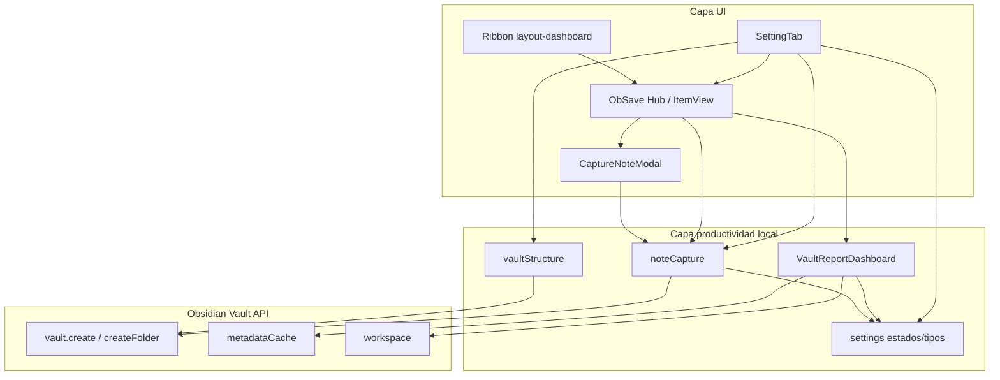

# ObSave — Arquitectura

## Diagrama de Capas

## Definición de Capas

### 1. UI (Presentación)
- **Responsabilidad:** Ajustes, Hub lateral, modal de nueva nota y ribbon.
- **Componentes:** `ObSaveSettingTab`, `ObSaveSidebarView`, `CaptureNoteModal`, `VaultReportDashboard`.
- **Regla:** No hay motor de red ni estado de sync; las acciones delegan a la capa de productividad.

### 2. Productividad local (Dominio)
- **Responsabilidad:** Crear estructura de carpetas, notas rápidas/nuevas y métricas de la bóveda.
- **Contratos:** `generateVaultTemplateFolders(app)`, `createQuickDailyNote(app, settings)`, `createCaptureNote(app, settings, options)`, métricas vía `metadataCache` con colores de estado.
- **Regla:** Solo el sistema de archivos nativo de Obsidian. Cero HTTP, OAuth o manifiestos remotos. Tipos desvinculados de las carpetas.

### 3. Persistencia local
`ObSaveSettings` guarda `statuses` (id, nombre, color, impactoSalud) y `types` (id, nombre). Al cargar se descartan claves de sync v1.x si aparecen, y se borran restos de `ledger.json`.

### 4. Capa retirada (v2.0.0)
Hasta v1.2.3 existían `SyncEngine`, `StorageAdapters`, `OAuthHandler` y `LedgerManager`. Se eliminaron por completo: no hay proveedores, tokens ni temporizadores de auto-sync.

## Comandos activos

1. `open-obsave-panel` — Abrir panel principal de ObSave
2. `obsave-hub` — Abrir ObSave Hub lateral
3. `obsave-quick-note` — Crear nota rápida ObSave
4. `obsave-capture-note` — Crear nueva nota ObSave

## Persistencia

v2.1.0 persiste estados y tipos en `data.json`. Las claves de sync v1.x se ignoran; los archivos `ledger.json` / `.bak` / `.tmp` se intentan borrar al cargar.

v2.1.3: el YAML de `estado`/`tipo` se escribe solo sobre `view.file` del leaf Markdown que contiene el selector. El badge del explorador se asocia por `data-path === file.path`; un cambio de metadatos actualiza únicamente esa ruta.
