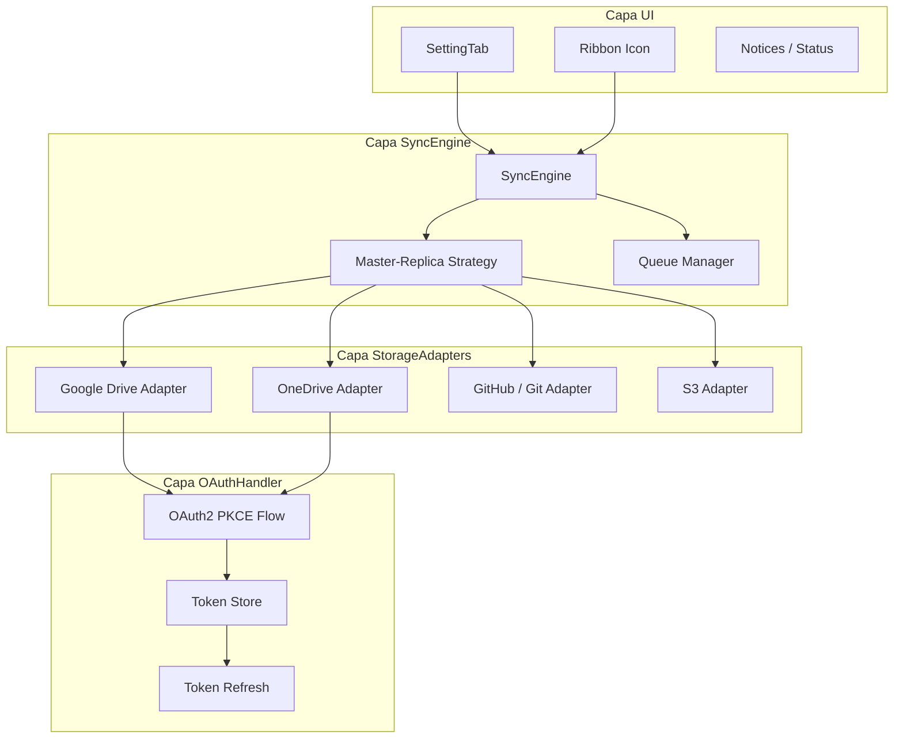

# ObSave — Arquitectura

## Diagrama de Capas



## Definición de Capas

### 1. UI (Presentación)
- **Responsabilidad:** Interacción con el usuario en Obsidian.
- **Componentes:** `ObSaveSettingTab`, ribbon icon, notices de estado.
- **Regla:** No contiene lógica de sincronización; delega al SyncEngine.

### 2. SyncEngine (Dominio)
- **Responsabilidad:** Orquestar la estrategia Master-Réplicas.
- **Contratos:** Consume `StorageAdapter`, expone estado de sync (`idle` | `syncing` | `error`).
- **Flujo:** Detectar cambios en Master → encolar → replicar a Réplicas.

### 3. StorageAdapters (Infraestructura)
- **Responsabilidad:** Abstraer cada backend (Drive, OneDrive, Git, S3).
- **Contrato:** Interface `StorageAdapter` en `src/types.ts`.
- **Regla:** Cada adapter implementa `connect`, `pull`, `push`, `disconnect`.

### 4. OAuthHandler (Seguridad)
- **Responsabilidad:** Flujo OAuth2 PKCE vía navegador nativo.
- **Regla:** Sin ventanas colgadas ni esquemas `obsidian://` para tokens.
- **Almacenamiento:** Tokens cifrados en settings del plugin (futuro).

## Modelo de Datos (Settings)

```typescript
ObSaveSettings {
  masterRepo: RepoConfig | null
  replicaRepos: RepoConfig[]
  syncIntervalMinutes: number
  lastSyncAt: string | null
}

RepoConfig {
  id: string
  role: 'master' | 'replica'
  provider: string
  remoteUrl?: string
  credentials?: EncryptedCredentials
}
```

## Flujo de Sincronización (Target)

```
1. Usuario modifica vault local
2. SyncEngine detecta delta respecto al Master
3. Push al Master
4. Para cada Réplica: pull desde Master → push a Réplica
5. Actualizar ribbon icon + lastSyncAt
```

## Fase 1 — Estado Actual
Solo UI + SyncEngine stub. Adapters y OAuthHandler son placeholders para fases posteriores.
