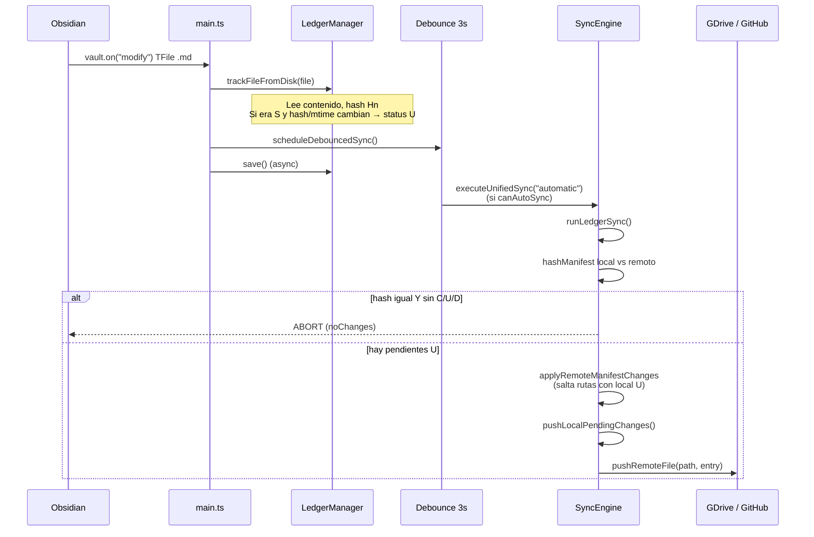

# Informe de Auditoría Técnica — ObSave v1.1.2

**Ad Astra Forge** · Plugin ObSave  
**Fecha:** 10 de septiembre de 2026  
**Commit auditado:** `2eee3ed` (release v1.1.2)  
**Alcance:** Diagnóstico de causa raíz — (1) notas en estado `U` que no actualizan contenido remoto; (2) duplicación de `05_Archivadas` en Google Drive al usar «Generar carpetas de la bóveda»  
**Nota:** Solo auditoría; **sin cambios de código ni release** asociados a este informe.

---

## Resumen ejecutivo

| # | Área | Veredicto | Severidad | Causa raíz principal |
|---|------|-----------|-----------|----------------------|
| 1 | Subida de notas editadas (`U`) | **Regresión confirmada** | **Crítica** | Atajo en `pushRemoteFile` (GDrive) marca `S` **sin** llamar a `uploadFile` cuando `U + remoteId + hash local coincide`; diseñado para renombres, aplica también a ediciones de contenido |
| 1b | Trailing hash + segundo ciclo | **Riesgo confirmado** | **Alta** | Tras subida parcial, un ciclo posterior puede volver a ejecutar el mismo atajo y cerrar en `S` con remoto desactualizado |
| 2 | Duplicación `05_Archivadas` (Drive) | **Causa probable confirmada** | **Alta** | Dos vías independientes (`syncTemplateFoldersToGoogleDrive` y `pushRemoteFolder`) llaman `findOrCreateSubfolder` **sin mutex** ni actualización del ledger; condición de carrera si coinciden con auto-sync o push de carpeta `C` |

---

## 1. Auditoría: notas editadas que no suben cambios a la nube

### 1.1 Síntoma reportado

Una nota ya sincronizada (`S`, con `remoteId`) pasa a **amarillo** (`U`) tras editar en Obsidian, pero el contenido en Google Drive o GitHub **no refleja** la edición, aunque el badge pueda volver a verde en algún ciclo.

### 1.2 Secuencia exacta: evento `modify` → decisión de subida



#### Paso a paso (referencias de código v1.1.2)

1. **`vault.on("modify")`** — `main.ts` → `onVaultModify`: solo archivos `.md` bajo rutas no excluidas.
2. **`LedgerManager.trackFileFromDisk`** — recalcula hash/mtime/size:
   - Si no hay entrada → `C`.
   - Si `S` y hash **y** mtime iguales al disco → **return** (sin pasar a `U`).
   - Si `C` → actualiza hash/mtime, **mantiene `C`**.
   - En cualquier otro caso (`S` con cambio, `U`, etc.) → **`status = "U"`** y hash actualizado.
3. **`scheduleDebouncedSync`** — reinicia timer de **3000 ms**; al vencer, llama `executeUnifiedSync("automatic")` **solo si** `canAutoSync()` (proveedor conectado, auto-sync ON, carpeta Drive seleccionada si aplica).
4. **`runLedgerSync`** — Paso 1: si `hashManifest(local) === hashManifest(remoto)` **y** `!hasPendingChanges()`, **aborta todo el ciclo** (no sube). Con entrada `U`, `hasPendingChanges()` es **true** → el ciclo continúa.
5. **`applyRemoteManifestChanges`** — para cada ruta remota, si el local tiene `C`, `U` o `D`, **no sobrescribe** el local (protege la edición pendiente).
6. **`pushLocalPendingChanges`** — incluye la ruta en `pendingPaths()` porque `status === "U"`.
7. **`pushRemoteFile`** — aquí está la bifurcación crítica (ver §1.3).

### 1.3 Causa raíz principal (Google Drive): atajo «path-only» mal aplicado

En `SyncEngine.pushRemoteFile` (aprox. líneas 547–561):

```typescript
if (
  providerId === "gdrive" &&
  entry.status === "U" &&
  entry.remoteId &&
  entry.hash === hashAtUploadStart
) {
  this.ledgerManager.markSynchronized(path, { ... });
  return true; // ← NO llama a uploadFile / PATCH
}
```

**Intención original (v1.1.2):** tras renombrar una carpeta en Drive, los hijos conservan el mismo `fileId`; si solo cambió la ruta en el ledger y el **hash no cambió**, no hace falta re-subir bytes.

**Efecto colateral:** tras una **edición real**, `trackFileFromDisk` deja `entry.hash === hashAtUploadStart` (mismo contenido leído en modify y en push). Se cumple la condición **`U + remoteId + hash igual`**, el motor **marca `S` localmente sin PATCH** al archivo remoto. El contenido en Drive **sigue siendo el anterior**.

| Condición | ¿Edición de contenido? | ¿Sube PATCH? |
|-----------|------------------------|--------------|
| `U`, hash local ≠ hash en remoto (no modelado) | Sí | Depende del atajo |
| `U`, hash local = hash disco, atajo GDrive | Sí | **No** → **BUG** |
| `U`, sin `remoteId` | Sí | Sí (`uploadFile` create) |
| GitHub `U` con `remoteId` | Sí | Sí (`uploadRemoteFile` con `sha`) |

**Conclusión:** el bloqueo **no** está en `vault.on("modify")` ni en que `trackFileFromDisk` omita `U`. El fallo dominante en **Google Drive** es el **early return** que confunde «hash estable» con «remoto ya actualizado».

### 1.4 Rol de `finalizeFilePush` (trailing hash)

Tras una subida real, `finalizeFilePush`:

1. Re-lee el archivo y calcula `hashAfter`.
2. Si `hashAfter !== hashAtUploadStart` → mantiene **`U`**, asigna `remoteId`, pone **`pendingAutoSync = true`** (correcto para edición durante upload).
3. Si coinciden → **`markSynchronized` (`S`)**.

**Interacción peligrosa con el atajo GDrive:**

1. Primer ciclo: sube bytes parciales; trailing hash detecta cambio → queda `U` con `remoteId`.
2. Segundo ciclo (auto o cola): `hashAtUploadStart === entry.hash` (usuario dejó de escribir), se ejecuta de nuevo el **atajo sin PATCH** → **`S` con remoto incompleto**.

El trailing hash **no bloquea** la primera subida; el problema es el **segundo ciclo** que puede **saltarse** la re-subida en GDrive.

### 1.5 Factores contribuyentes (no bloquean `U`, pero impiden ver sync)

| Factor | Efecto |
|--------|--------|
| `autoSyncEnabled === false` | `scheduleDebouncedSync` no ejecuta sync; la nota queda `U` hasta sync manual |
| GDrive sin carpeta seleccionada | `canAutoSync()` false |
| Usuario edita durante ciclo activo | Debounce reinicia; subida se retrasa (no es skip permanente) |
| `hashManifest` abort | No aplica si hay `U` en ledger |

### 1.6 GitHub

No existe el atajo GDrive. Flujo normal: `uploadRemoteFile(path, content, entry.remoteId)` → API PUT con `sha` previo. Si las ediciones no suben en GitHub, revisar token, rama `main`, errores en consola y si el ciclo llega a `pushRemoteFile` (mismos requisitos de auto-sync).

---

## 2. Auditoría: duplicación de `05_Archivadas` en Google Drive

### 2.1 Síntoma reportado

Al pulsar **«Generar carpetas de la bóveda»**, en Google Drive aparecen **dos** carpetas `05_Archivadas`, mientras en la bóveda local y en `.obsave/ledger.json` hay **una** entrada.

### 2.2 Flujo del botón

`ObSaveSettingTab.generateAndSyncVaultFolders()`:

1. `generateVaultTemplateFolders(app)` — crea localmente solo carpetas **ausentes** (`vaultStructure.ts`; incluye `05_Archivadas` en `VAULT_TEMPLATE_FOLDERS`).
2. Si hay proveedor configurado → **`syncEngine.syncTemplateFoldersToCloud()`** de forma **directa** (no espera al debounce de 3 s).
3. `structureSyncNeeded = false`.

Para Google Drive, `syncTemplateFoldersToGoogleDrive`:

```typescript
for (const templateFolder of VAULT_TEMPLATE_FOLDERS) {
  await provider.resolveOrCreateFolderPath(root.folderId, templateFolder);
}
```

Cada llamada termina en `GoogleDriveProvider.findOrCreateSubfolder`: **GET search** por `name + parent`; si vacío → **POST create**.

### 2.3 Por qué el ledger no evita duplicados en Drive

- **`syncTemplateFoldersToGoogleDrive` no escribe** en `ledger.json` (no `remoteId`, no pasa a `S`).
- Las carpetas plantilla suelen quedar en ledger como **`C`** vía `vault.on("create")` → `trackFolder`, o ya en **`S`** si un sync anterior registró `remoteId`.
- La duplicación ocurre **en la nube**, no en el manifiesto: el ledger puede referenciar **un solo** `remoteId` mientras Drive muestra **dos** carpetas homónimas bajo el mismo padre.

### 2.4 Causa raíz: doble vía de creación + carrera en `findOrCreateSubfolder`

Existen **dos mecanismos independientes** que crean la misma ruta lógica en Drive:

| Vía | Disparador | API |
|-----|------------|-----|
| A | Botón → `syncTemplateFoldersToGoogleDrive` | `resolveOrCreateFolderPath("05_Archivadas")` |
| B | `executeUnifiedSync` → `pushRemoteFolder` (entrada carpeta `C`/`U` sin uso de rename) | `resolveOrCreateFolderPath(root, path)` (línea ~683) |
| C | Mismo ciclo si `structureSyncNeeded` | `runLedgerSync` inicia con `syncTemplateFoldersToCloud` **y** luego `pushLocalPendingChanges` |

**Condición de carrera clásica** en `findOrCreateSubfolder`:

```text
Proceso 1: GET search → 0 resultados
Proceso 2: GET search → 0 resultados  (indexación Drive aún no refleja creación)
Proceso 1: POST create → carpeta Id-A
Proceso 2: POST create → carpeta Id-B   ← duplicado visible en UI
```

No hay cerrojo por `(parentId, name)` en el plugin. El `folderPathCache` solo evita trabajo **secuencial** repetido en la **misma** instancia; **no** serializa dos llamadas concurrentes.

### 2.5 ¿Interviene `vault.on("create")` en paralelo con el botón?

**Escenario A — `05_Archivadas` ya existía localmente:**

- `generateVaultTemplateFolders` **no** crea carpeta → **no** dispara `create`.
- Solo corre la vía A (template sync), secuencial → duplicado **menos probable** salvo **auto-sync concurrente** (vía B/C).

**Escenario B — carpeta recién creada en el mismo clic:**

- `createFolder` → `onVaultCreate` → `trackFolder` (`C`) + **`scheduleDebouncedSync` (3 s)**.
- Inmediatamente después, vía A crea/resuelve en Drive.
- A los 3 s, vía B puede ejecutar `pushRemoteFolder` para la misma ruta `C` → **segunda** resolución/creación si el ledger **aún no** tiene `remoteId` actualizado tras A.

**Conclusión sobre el listener:** no es obligatorio que dos `create` locales existan; la carrera relevante es **`syncTemplateFoldersToGoogleDrive` ∥ `pushRemoteFolder`** (auto-sync o cola `pendingAutoSync`), no dos handlers `create` duplicando la misma carpeta local.

### 2.6 Por qué se percibe a menudo en `05_Archivadas`

- Es la **última** del bucle `VAULT_TEMPLATE_FOLDERS`; si el usuario observa el final del árbol en Drive, el duplicado reciente es más visible.
- Si hubo reintentos, sync manual o auto-sync **solapado** con el botón, la carrera en la **última** iteración del bucle coincide con el inicio de un ciclo de ledger que aún procesa carpetas `C` en orden lexicográfico (`05_*` tras `00`–`04`).

### 2.7 Evidencia negativa (descartes)

| Hipótesis | Veredicto |
|-----------|-----------|
| Dos entradas `05_Archivadas` en ledger | **Descartado** como causa de duplicado remoto (síntoma es nube ≠ manifiesto) |
| `renamePathCascade` | No interviene en «Generar carpetas» |
| `updateDriveFolder` | Solo aplica a carpeta `U` con `remoteId`; plantilla sync no lo usa |

---

## 3. Recomendaciones de corrección (solo orientación; fuera de alcance de este informe)

1. **GDrive `pushRemoteFile`:** restringir el atajo «sin PATCH» a casos con **`previousPath`** (renombre) o bandera explícita; **nunca** solo por `U + hash igual`.
2. **Trailing hash:** si el primer upload terminó con `U` pendiente, **forzar** `uploadFile` en el siguiente ciclo aunque hash local sea estable.
3. **Carpetas plantilla:** tras `resolveOrCreateFolderPath`, **actualizar ledger** (`remoteId`, `S`); unificar creación en un solo servicio con **mutex** por `(rootFolderId, relativePath)`.
4. **Botón «Generar carpetas»:** evitar llamar template sync mientras `syncInFlight`, o reutilizar solo el motor ledger (una vía).

---

## 4. Metodología

- Revisión estática de `src/engine/SyncEngine.ts`, `src/main.ts`, `src/ledger/LedgerManager.ts`, `src/productivity/vaultStructure.ts`, `src/productivity/vaultFolderSync.ts`, `src/ui/ObSaveSettingTab.ts`, `src/providers/GoogleDriveProvider.ts`.
- Trazado de flujos de eventos Obsidian y comparación con comportamiento esperado del manifiesto v1.1.x.
- Sin modificación de código ni ejecución de pruebas E2E contra APIs en vivo en esta auditoría.

---

**Fin del informe — ObSave v1.1.2 → diagnóstico v1.1.3**
