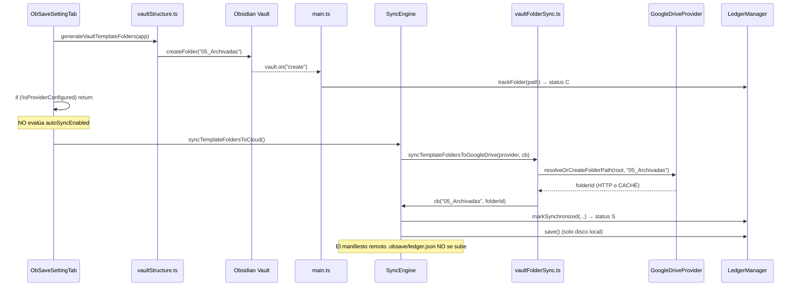

# Auditoría Técnica Holística e Integral — ObSave v1.1.3

**Ad Astra Forge** · Plugin ObSave
**Fecha:** 10 de septiembre de 2026
**Commit auditado:** `afaa5a1` (release v1.1.3)
**Alcance:** Ciclo de vida de creación de carpetas, estados del Ledger en modo offline / auto-sync desactivado, integridad del manifiesto y barrido de puntos ciegos
**Nota:** Informe de solo diagnóstico. **No se modificó código ni se publicó versión alguna.**

---

## Resumen ejecutivo

Se identificaron **21 hallazgos**, de los cuales **3 son críticos**. El más grave (**H-01**) no fue el reportado por el usuario: la sincronización **multi-dispositivo está funcionalmente rota**, porque un dispositivo secundario marca como sincronizado todo lo que el manifiesto remoto declara en `S` sin descargar ni un solo archivo.

| ID | Área | Severidad | Síntoma / causa raíz |
|----|------|-----------|----------------------|
| **H-01** | `SyncEngine.applyRemoteManifestChanges` | **Crítica** | Entradas remotas en `S` se copian al ledger local sin verificar existencia en disco → segundo dispositivo **nunca descarga nada** |
| **H-02** | Botón «Generar carpetas» sin auto-sync | **Crítica** | `registerRemoteFolder` marca `S` sin propagar el manifiesto remoto; con auto-sync OFF el ciclo nunca corre → `S` local huérfano y motor que ignora las carpetas |
| **H-03** | `pushRemoteFolder` (GitHub) | **Crítica** | `return entry.remoteId ?? path` → `S` con `remoteId` = ruta literal y **cero peticiones HTTP** |
| **H-04** | `LedgerManager.trackFolder` | **Alta** | Retorno temprano si existe entrada: carpeta en `D` recreada localmente sigue en `D` → **borrado remoto de carpeta viva** |
| **H-05** | `folderPathCache` (Drive) | **Alta** | `resolveOrCreateFolderPath` puede devolver id cacheado sin HTTP; id obsoleto si la carpeta se borró en Drive |
| **H-06** | `FileStatusDecorator.resolveFolderStatus` | **Alta** | Carpeta sin entrada en ledger y sin hijos pendientes se pinta **🟢 verde** |
| **H-07** | `main.disconnectProvider` | **Alta** | No limpia `ledger.json` (solo `settings.syncedLedger`) → tras reconectar a otra cuenta quedan `S` con `remoteId` ajenos |
| **H-21** | `LedgerManager.load` | **Alta** | JSON corrupto degrada en silencio a manifiesto vacío, sin backup ni aviso |
| **H-08** | `deleteRemotePath` | **Media-Alta** | Sin `remoteId` no borra nada pero el llamador elimina la entrada → huérfano remoto silencioso |
| **H-09** … **H-20** | Varios | Media / Baja | Ver §4 |

---

## 1. Estado inicial incorrecto de carpetas creadas sin auto-sync

### 1.1 Flujo exacto del botón «Generar carpetas de la bóveda»



### 1.2 Por qué termina en `S` y no en `C`

**Causa raíz directa:** `ObSaveSettingTab.generateAndSyncVaultFolders()` invoca `syncTemplateFoldersToCloud()` con una única guarda, `isProviderConfigured(settings)`. **No consulta `autoSyncEnabled` ni el estado del temporizador.** Desde la v1.1.3, esa ruta ejecuta el callback `registerRemoteFolder`, que llama a `markSynchronized` y escribe `S`:

```typescript
// SyncEngine.ts — registerRemoteFolder
this.ledgerManager.markSynchronized(vaultPath, { type: "folder", remoteId });
```

`markSynchronized` es incondicional: sobreescribe `C` con `S`. Y aunque el evento `vault.on("create")` llegue **después**, no puede revertirlo, porque `trackFolder` sale antes de tocar el estado:

```typescript
// LedgerManager.ts — trackFolder
trackFolder(path: string): void {
	if (this.manifest.entries[path]) {
		return;                       // ← no degrada S → C
	}
	this.manifest.entries[path] = { type: "folder", status: "C" };
}
```

Resultado: **en cualquier orden de ejecución el estado final es `S`.**

### 1.3 ¿Realmente falta confirmación HTTP?

Parcialmente, y esa es la parte sutil. `resolveOrCreateFolderPath` **sí** hace `GET` + `POST` en camino frío, así que la carpeta existe en Drive. Pero el `S` es **falso a nivel de protocolo** por tres motivos:

1. **Caché sin red (H-05).** `folderPathCache` indexa por `rootFolderId:ruta`. Si la ruta se resolvió antes en la misma sesión, `resolveSubfolderExclusive` devuelve el id cacheado **sin una sola petición**. Si esa carpeta fue borrada en Drive entretanto, se otorga `S` con un `remoteId` muerto.
2. **El manifiesto remoto nunca se sube.** En el modelo v1.1.x, «sincronizado» significa *presente y consistente en `.obsave/ledger.json` remoto*. `syncTemplateFoldersToCloud` solo persiste el ledger **local**; la subida del manifiesto vive exclusivamente en `runLedgerSync`. Con auto-sync OFF ese ciclo no se ejecuta jamás.
3. **En GitHub el `S` puede no tener red detrás (H-03).** Ver §4.

### 1.4 Por qué el motor ignora después esas carpetas

El push solo recorre entradas pendientes:

```typescript
// LedgerManager.pendingPaths — filtra C | U | D
pendingPaths(): string[] {
	return Object.entries(this.manifest.entries)
		.filter(([, e]) => e.status === "C" || e.status === "U" || e.status === "D")
		.map(([p]) => p);
}
```

Una carpeta en `S` **queda fuera de `pushLocalPendingChanges` para siempre**. Cuando el usuario activa la sincronización más tarde:

1. `hasPendingChanges()` puede ser `false` → si además el hash del manifiesto coincidiera, el ciclo **aborta en el Paso 1**.
2. Si el ciclo corre, `pushLocalPendingChanges` **salta** las carpetas (no son pendientes) y solo se sube el manifiesto completo al final.
3. Si el `remoteId` cacheado era obsoleto o la carpeta se creó bajo otra cuenta, nada la recrea: no hay verificación de existencia para entradas en `S`.

**Agravante (H-04).** `trackFolder` tampoco recupera una carpeta marcada `D`. Secuencia reproducible con auto-sync OFF:

| Paso | Acción | Estado en ledger |
|------|--------|------------------|
| 1 | Sync previa correcta | `S` |
| 2 | Usuario borra `05_Archivadas` localmente | `D` (más hijos en `D`) |
| 3 | Auto-sync OFF → no se propaga | `D` |
| 4 | Usuario recrea `05_Archivadas` | **`D`** (retorno temprano) |
| 5 | Usuario activa auto-sync | `deleteRemotePath` → **borra la carpeta en Drive/GitHub** |

Es decir, recrear una carpeta puede provocar su **borrado remoto recursivo**.

---

## 2. Inconsistencia entre flujos con y sin auto-sync

### 2.1 Comparativa de rutas

| Etapa | Auto-sync **ACTIVA** | Auto-sync **DESACTIVADA** |
|-------|----------------------|---------------------------|
| Creación local | `trackFolder` → `C` | `trackFolder` → `C` |
| Template sync (botón) | Se ejecuta → `S` + `ledger.save()` | **Se ejecuta igual** → `S` + `ledger.save()` |
| `scheduleDebouncedSync` (3 s) | `canAutoSync()` **true** → `executeUnifiedSync` | `canAutoSync()` **false** → **return silencioso** |
| Manifiesto remoto | Se sube al cierre de `runLedgerSync` | **Nunca se sube** |
| `lastSyncAt` | Se actualiza | Permanece obsoleto |
| Convergencia | Local y remoto reconcilian | **Divergencia permanente** hasta un sync manual |

La asignación `C` vs `S` **es idéntica en ambos flujos**; lo que cambia es la **reconciliación posterior**. Con auto-sync activa el ciclo enmascara el defecto de §1 porque sube el manifiesto 3 s después. Con auto-sync desactivada el `S` prematuro queda expuesto y es el estado final observable.

### 2.2 Tercer desenlace: Drive sin carpeta seleccionada

`syncTemplateFoldersToCloud` exige `isGoogleDriveFolderReady()`. Si el proveedor es Drive pero no hay carpeta elegida, la función **no hace nada y no informa** (cae hasta la rama `github`, que tampoco aplica, y retorna). Las carpetas quedan en `C`. La misma acción de usuario produce por tanto **tres desenlaces distintos** según estado en memoria: `S` con red, `S` desde caché, o `C` sin aviso.

### 2.3 Dependencias de memoria y entorno que alteran el resultado

| Dependencia | Ámbito | Efecto sobre `C`/`S` |
|-------------|--------|----------------------|
| `folderPathCache` | Instancia `GoogleDriveProvider` | `S` sin HTTP; se vacía al recargar el plugin |
| `targetFolderResolution` | Instancia `GoogleDriveProvider` | Serializa la raíz; se pierde al recargar |
| `GoogleDriveLazyProvider.delegate` | Lazy | Primera llamada carga módulo y caché vacía → sí hay HTTP |
| `remoteLedgerId` | `SyncEngine`, en memoria | Tras recarga fuerza refetch del manifiesto |
| `LedgerManager.loaded` | En memoria | `runLedgerSync` recarga si es `false` |
| `settings.autoSyncEnabled` | `data.json` | **No** afecta a la asignación de estado, solo a la reconciliación |

**Hallazgo adicional (H-12): `requestStructureSync()` es código muerto.** Ninguna ruta lo invoca; `structureSyncNeeded` solo se asigna a `false`. En consecuencia la rama de plantillas dentro de `runLedgerSync` **nunca se dispara** y el botón manual es la **única** vía que materializa las carpetas plantilla en la nube.

---

## 3. Integridad del manifiesto `.obsave/ledger.json`

### 3.1 Dos almacenes sin transacción común

| Almacén | Ruta | Escritor | Contenido |
|---------|------|----------|-----------|
| Ajustes | `.obsidian/plugins/obsave/data.json` | `Plugin.saveData` | Credenciales, `autoSyncEnabled`, `syncedLedger` (legacy) |
| Manifiesto | `.obsidian/plugins/obsave/ledger.json` | `adapter.write` | Estados `C/U/D/S`, `remoteId`, hashes |

No hay bloqueo, escritura atómica (temp + rename) ni versión de secuencia entre ambos.

### 3.2 Carreras identificadas

**H-10 — `save()` concurrente sin cerrojo.** Tres emisores escriben el mismo archivo sin coordinación: `persistLedger` (en cada evento del vault), `syncTemplateFoldersToCloud` y `runLedgerSync`. `JSON.stringify` es síncrono pero `adapter.write` es asíncrono, así que **una instantánea antigua puede aterrizar después de una nueva**. En `main.ts` las llamadas son *fire-and-forget*:

```typescript
const persistLedger = (): void => { void this.ledgerManager.save(); };
// ...
this.app.vault.on("create", (file) => { void this.onVaultCreate(file).then(persistLedger); })
```

**H-21 — Degradación silenciosa ante JSON corrupto.** Si una escritura concurrente trunca el archivo, `load()` captura la excepción y **arranca con un manifiesto vacío**, sin backup ni notificación:

```typescript
} catch {
	this.manifest = createEmptyManifest(this.getDeviceName());
}
```

El daño se amplifica al combinarse con **H-01**: manifiesto vacío → sin pendientes → el ciclo copia el remoto → todo queda en `S` local **sin comprobar el disco**. La bóveda puede quedar «verde» y desincronizada de forma indefinida.

**H-11 — `S` persistido antes de confirmar el manifiesto remoto.** En `runLedgerSync` el orden es: marcar `S` → `ledgerManager.save()` → `uploadRemoteLedger()`. Si la subida falla, en disco ya consta `S`. El contenido de los archivos sí llegó a la nube, de modo que el impacto se limita al desfase del manifiesto, corregible en el ciclo siguiente por diferencia de hash.

**H-07 — Desconexión asimétrica.** `disconnectProvider` limpia `settings.syncedLedger` y anula el proveedor, pero **deja intacto `ledger.json`**. Al reconectar contra otra cuenta o repositorio persisten entradas `S` con `remoteId` de la cuenta anterior; el motor las considera sincronizadas y **nunca las sube**, o bien intenta `PATCH` sobre ids inexistentes y aborta el ciclo con error.

**Sobre sobrescritura de pendientes por estados limpios:** la protección principal funciona. `applyRemoteManifestChanges` salta toda ruta cuyo estado local sea `C`, `U` o `D`, y `finalizeFilePush` conserva `U` si el hash cambió durante la transferencia. La brecha real no es que `S` pise a `C/U/D`, sino que **`S` se conceda sin respaldo verificable** (H-01, H-02, H-03, H-05).

---

## 4. Puntos ciegos y regresiones potenciales

### 4.1 H-01 (Crítica) — El manifiesto remoto en `S` bloquea toda descarga

```typescript
// SyncEngine.applyRemoteManifestChanges
if (remoteEntry.status === "C" || remoteEntry.status === "U") {
	/* descarga real */
}
if (remoteEntry.status === "S") {
	this.ledgerManager.markSynchronized(path, remoteEntry);   // ← sin tocar el disco
}
```

El dispositivo que sube **deja todas sus entradas en `S`** antes de publicar el manifiesto. Por tanto, un segundo dispositivo recibe un manifiesto donde **todo está en `S`**, y la rama de descarga (`C`/`U`) **jamás se activa**. Peor aún, `markSynchronized(path, remoteEntry)` copia `hash`, `mtime` y `size` que describen el disco de **otro equipo**.

**Consecuencia:** ObSave se comporta como respaldo unidireccional. Un equipo nuevo, o una bóveda restaurada, muestra badges verdes con archivos inexistentes y nunca los descarga. Esto también explica por qué la restauración solo funciona tras usar «Reparar / Reconstruir Bóveda Remota».

### 4.2 H-03 (Crítica) — `S` sin ninguna petición HTTP en GitHub

```typescript
// SyncEngine.pushRemoteFolder — rama github
return entry.remoteId ?? path;      // ← "remoteId" = ruta literal
```

Para una carpeta **no vacía** en GitHub no se ejecuta ninguna llamada, y el llamador hace `markSynchronized(path, { remoteId })`. La carpeta queda en `S` **verde** con un `remoteId` que es su propia ruta. Al no existir concepto de carpeta en la API de contenidos de GitHub, el valor nunca podrá validarse ni servir para borrado o renombrado.

### 4.3 H-06 (Alta) — Falso verde en carpetas desconocidas

```typescript
// FileStatusDecorator.resolveFolderStatus — cola de la función
if (hasPendingChildren) { return "modified"; }
return "synced";                    // ← sin entrada en ledger → verde
```

Una carpeta ausente del manifiesto y sin hijos pendientes **se pinta verde**. Además `buildFolderPendingIndex` solo recorre entradas del ledger: si los hijos tampoco están registrados, no hay señal de pendiente. La UI afirma «sincronizada» sobre una entidad que el motor desconoce.

### 4.4 Inventario completo de `S` sin confirmación del proveedor

| ID | Ubicación | Naturaleza del `S` falso |
|----|-----------|--------------------------|
| H-01 | `applyRemoteManifestChanges` (rama `S`) | Copia del manifiesto ajeno sin verificar disco local |
| H-02 | `registerRemoteFolder` | `S` local sin publicar manifiesto remoto |
| H-03 | `pushRemoteFolder` (GitHub, carpeta con contenido) | Sin HTTP; `remoteId` = ruta |
| H-05 | `resolveOrCreateFolderPath` con caché | Sin HTTP; id potencialmente muerto |
| H-09 | `registerRemoteGitkeep` | `remoteId` de la **carpeta** = SHA del blob `.gitkeep` |
| H-13 | `syncTemplateFoldersToGoogleDrive` | Crea las 6 plantillas en Drive aunque no existan localmente; `registerRemoteFolder` las descarta → carpetas remotas huérfanas fuera del manifiesto |
| — | `applyRemoteManifestChanges` (carpeta remota `C`/`U`) | `markSynchronized(..., { remoteId: remoteEntry.remoteId })` acepta `undefined` |

### 4.5 Otros hallazgos del barrido

| ID | Sev. | Hallazgo |
|----|------|----------|
| **H-08** | Media-Alta | `deleteRemotePath` sin `remoteId` retorna en silencio, pero el llamador ejecuta `removeEntry` + `removeDescendantEntries`: el objeto **permanece en la nube** y desaparece del manifiesto → huérfano invisible |
| **H-14** | Media | Asimetría de proveedores: en Drive las 6 plantillas se reportan; en GitHub **solo las vacías** reciben `.gitkeep` y callback |
| **H-16** | Media | `clearGitHubStorage` borra **todos** los blobs del repositorio salvo `.obsidian/` y `.git/` — destructivo si el repo alberga otro contenido. En Drive, `clearRemoteStorage` usa `DELETE` **permanente**, no papelera |
| **H-17** | Media | Sin resolución de conflictos: si ambos lados cambian la misma ruta, el pendiente local gana y **la versión remota se pierde** sin copia de conflicto ni aviso |
| **H-19** | Media | `pullRemoteFile` (Drive) sin `remoteId` devuelve `false`; el llamador ignora el fallo y la entrada queda inconsistente sin reintento |
| **H-18** | Baja-Media | `confirmPathDeleted` (GitHub) considera «existe» cualquier respuesta distinta de 404, incluidos 401/403/500 y errores de red → decisiones erróneas ante fallos transitorios |
| **H-15** | Baja-Media | `hashContent` es djb2 de 32 bits: espacio de colisión reducido para un control de integridad de contenido |
| **H-20** | Baja | `onunload` no fuerza un *flush* final del ledger; una escritura en vuelo puede perderse al cerrar |

---

## 5. Plan de acción propuesto

### P0 — Corrección inmediata (integridad de datos)

1. **H-01.** En `applyRemoteManifestChanges`, tratar la rama `S` como *candidata a descarga*: comprobar existencia y hash en disco; si el archivo falta o difiere, descargar. Para carpetas, garantizar `ensureLocalFolder`. Es el requisito para que el modo multi-dispositivo funcione.
2. **H-03 / H-09.** Modelar las carpetas de GitHub sin `remoteId` sintético: usar un marcador explícito (`remoteId: undefined` + bandera `remoteVerified`) y no otorgar `S` sin confirmación de la API.
3. **H-04.** En `trackFolder`, si la entrada existente está en `D`, promover a `C` en lugar de retornar.
4. **H-02.** Publicar el manifiesto tras `syncTemplateFoldersToCloud`, o bien registrar las carpetas como `C` con el `remoteId` conocido y dejar que el ciclo las consolide en `S`.

### P1 — Robustez del manifiesto

5. **H-10 / H-21.** Serializar `save()` mediante cola de promesas, escribir a archivo temporal con *rename* atómico y conservar `ledger.json.bak`. Ante JSON inválido, restaurar el backup y notificar en lugar de degradar a vacío.
6. **H-07.** Reiniciar `ledger.json` en `disconnectProvider` y al cambiar de cuenta o repositorio.
7. **H-05.** Invalidar `folderPathCache` al inicio de cada ciclo, o revalidar el id con un `GET` ligero antes de conceder `S`.
8. **H-08.** No eliminar entradas del ledger si el borrado remoto no pudo ejecutarse; conservar `D` y reintentar.

### P2 — Consistencia y experiencia

9. **H-06.** El decorador debe distinguir «sin datos» de «sincronizado»: carpeta desconocida → 🔴 rojo.
10. **H-12.** Eliminar `requestStructureSync()` o conectarlo a un disparador real.
11. **H-17.** Introducir detección de conflicto con copia `nombre (conflicto DISPOSITIVO).md`.
12. **H-16.** Acotar `clearRemoteStorage` a rutas presentes en el manifiesto y usar papelera en Drive (`trashed: true`).
13. **H-15.** Migrar el hash a SHA-256 vía `crypto.subtle`, con versión en el manifiesto para migración progresiva.

---

## 6. Metodología

- Revisión estática del árbol `src/` en el commit `afaa5a1`: `engine/SyncEngine.ts`, `ledger/{LedgerManager,RemoteManifestStore,manifestHash,types}.ts`, `main.ts`, `ui/{FileStatusDecorator,ObSaveSettingTab}.ts`, `productivity/{vaultStructure,vaultFolderSync}.ts`, `providers/{GoogleDriveProvider,GoogleDriveLazyProvider,GitHubProvider}.ts`, `oauth/GitHubProvider.ts`, `settings.ts`, `settingsMerge.ts`.
- Trazado de los flujos de eventos de Obsidian (`create`, `modify`, `delete`, `rename`) hasta la decisión de red.
- Verificación cruzada de invocadores mediante búsqueda de símbolos (`requestStructureSync`, `structureSyncNeeded`, `pendingPaths`, `markSynchronized`).
- Sin ejecución de pruebas E2E contra APIs en vivo; los hallazgos derivan de análisis de flujo de control y de estado.

---

**Fin del informe — Auditoría holística ObSave v1.1.3**
