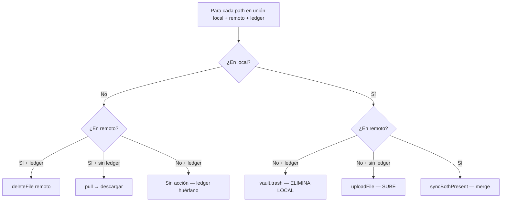

# Informe de Auditoría — ObSave v1.0.38

**Ad Astra Forge** · Plugin ObSave  
**Fecha:** 7 de septiembre de 2026  
**Alcance:** Eliminación automática de notas, generador de carpetas, atajos de teclado y badges `<kbd>`  
**Commit auditado:** `c235251` (release v1.0.38)  
**Nota:** Análisis sin release asociado.

---

## Resumen ejecutivo

| Área | Veredicto | Severidad |
|------|-----------|-----------|
| Eliminación de notas rápidas / captura | El `SyncEngine` **elimina localmente** archivos en la rama `inLocal && !inRemote && inLedger`; los helpers de productividad **no integran** con sync ni ledger | **Crítica** |
| Generador de carpetas | Implementación **correcta** (`getAbstractFileByPath` + `createFolder`); el vaciado de `00_Diarias` es **efecto colateral del sync**, no del botón | **Alta** (falsa atribución) |
| Atajos `Mod+Shift+*` | Comandos registrados correctamente; fallos por **conflictos Obsidian/OS/Electron** y posible incompatibilidad de `openTabById` | **Media** |
| Badges `<kbd>` | Muestran literalmente `Mod` en lugar de `Cmd` / `Ctrl` según plataforma | **Baja** (UX) |

---

## 1. Eliminación automática de notas nuevas (SyncEngine vs. Ledger)

### 1.1 Síntoma reportado

Una nota creada con **Nota rápida (1 clic)** o **Captura enriquecida** desaparece de la bóveda unos segundos después de crearse, coincidiendo con el ciclo de auto-sync (intervalo por defecto: **15 s**).

### 1.2 Flujo actual: productividad → sync

Los helpers en `src/productivity/noteCapture.ts` crean la nota con `app.vault.create()` y abren el editor. **No**:

- Notifican al `SyncEngine`
- Actualizan `syncedLedger`
- Marcan el archivo como pendiente de subida
- Posponen o inhiben el auto-sync

En `src/main.ts`, el listener `vault.on("create")` solo refresca decoradores del explorador:

```typescript
this.app.vault.on("create", (file) => {
  if (file.path.endsWith(".md") && this.syncEngine.getStatus() !== "syncing") {
    void this.refreshDecoratorsImmediate();
  }
});
```

El auto-sync se programa en `SyncEngine.startAutoSync()` con `syncIntervalSeconds` (default **15** en `src/settings.ts`).

### 1.3 Matriz de decisión del SyncEngine (3 vías)

Tanto `runGoogleDriveBidirectionalSync` como `runGitHubBidirectionalSync` aplican la misma lógica sobre la unión de paths:

- Archivos locales (`getMarkdownFiles()`)
- Archivos remotos (`listAllMarkdownFiles()`)
- Claves del `syncedLedger`

| inLocal | inRemote | inLedger | Acción actual | Interpretación |
|---------|----------|----------|---------------|----------------|
| ❌ | ✅ | ✅ | `deleteFile` remoto | Borrado local propagado a nube |
| ❌ | ✅ | ❌ | `pull` → descargar | Archivo nuevo en remoto |
| ❌ | ❌ | ✅ | **Sin acción** | Entrada ledger huérfana (bug menor) |
| ✅ | ❌ | ✅ | **`vault.trash(local, true)`** | **Asume borrado remoto → elimina local** |
| ✅ | ❌ | ❌ | `uploadFile` → subir | Archivo nuevo local |
| ✅ | ✅ | * | `syncBothPresent` | Resolución por mtime/hash |

**Código crítico (Google Drive, L332–358; GitHub equivalente L476–494):**

```typescript
if (inLocal && !inRemote && inLedger) {
  await this.app.vault.trash(localFile, true);
  delete ledger[path];
  continue;
}

if (inLocal && !inRemote && !inLedger) {
  // uploadFile + registrar en ledger
  continue;
}
```

### 1.4 Respuesta directa al escenario del auditor

> *Si un `.md` existe en local, NO en Google Drive/GitHub y NO está en `syncedLedger`, ¿por qué se trata como borrado remoto?*

**En el código v1.0.38, no debería.** Ese caso cae en la rama de **subida** (`!inLedger`).

Si el usuario observa eliminación, el escenario real es casi siempre **`inLedger === true`** por una de estas causas:

| # | Escenario | Mecanismo |
|---|-----------|-----------|
| A | **Ledger obsoleto** tras cambio de proveedor, carpeta Drive o repo GitHub sin limpiar ledger | Paths previos sincronizados → remoto no los lista → rama de papelera |
| B | **Colisión de path** en captura enriquecida (mismo título `.md`) | Ledger conserva entrada aunque el archivo local anterior fue borrado |
| C | **Subida Drive sin ID confirmado** | `pushLocalFile` registra ledger pero `listFiles` no encuentra el archivo recién subido → siguiente ciclo: `inRemote=false`, `inLedger=true` → papelera |
| D | **Archivos borrados en remoto** (UI web Drive/GitHub) | Comportamiento intencional del motor: propagar borrado remoto a local |

### 1.5 ¿Notifica el helper de productividad al SyncEngine?

**No.** `createQuickDailyNote` y `createCaptureNote` son funciones puras sobre `App`:

- Crean carpeta si no existe (`createFolder`)
- Crean el archivo (`vault.create`)
- Muestran `Notice` y abren la nota

No hay referencia a `ObSavePlugin`, `SyncEngine`, ni `syncedLedger`.

### 1.6 Amplificadores identificados

#### A) Ledger no se limpia al conectar GitHub

`synceLedger = {}` solo ocurre en:

- `disconnectProvider()` (`main.ts`)
- Selección de carpeta Drive existente (`ObSaveSettingTab.openGoogleFolderPicker`)

**No** se limpia al conectar GitHub ni al usar el generador de carpetas.

#### B) `pushLocalFile` y ID remoto incierto (Google Drive)

Tras `uploadFile`, el ID se obtiene con un `listFiles` posterior:

```typescript
const remoteFiles = await provider.listFiles(parentFolderId);
const created = remoteFiles.find((file) => file.name === fileName);
return created?.id ?? existingFileId ?? "";
```

Si la API no devuelve el archivo aún (latencia, caché), el ledger se guarda **con entrada pero sin `driveFileId` fiable**. El ciclo siguiente puede interpretar `!inRemote && inLedger` y **eliminar local**.

#### C) Intervalo de auto-sync = 15 s

Explica el retardo percibido entre crear la nota y su desaparición.

### 1.7 Diagrama de flujo (decisión por path)



---

## 2. Generador de carpetas (`generateVaultTemplateFolders`)

### 2.1 Síntoma reportado

Al pulsar **[Generar carpetas de la bóveda]**, la carpeta `00_Diarias` y su contenido previo desaparecen o quedan vacías.

### 2.2 Implementación auditada

Archivo: `src/productivity/vaultStructure.ts`

```typescript
export const VAULT_TEMPLATE_FOLDERS = [
  "00_Diarias", "01_Proyectos", "02_Ideas",
  "03_Personales", "04_Trabajo", "05_Archivadas",
] as const;

export async function generateVaultTemplateFolders(app: App): Promise<string[]> {
  const created: string[] = [];
  for (const folder of VAULT_TEMPLATE_FOLDERS) {
    if (!app.vault.getAbstractFileByPath(folder)) {
      await app.vault.createFolder(folder);
      created.push(folder);
    }
  }
  // Notice según created.length
  return created;
}
```

### 2.3 Respuestas de auditoría

| Pregunta | Resultado |
|----------|-----------|
| ¿Usa `app.vault.createFolder()`? | **Sí** |
| ¿Verifica existencia con `getAbstractFileByPath()`? | **Sí**, antes de cada creación |
| ¿Contiene llamadas a `trash`, `delete`, `remove` o `modify`? | **No** |
| ¿Puede borrar contenido de `00_Diarias`? | **No directamente** |

### 2.4 Causa raíz probable (correlación temporal)

Secuencia más plausible:

1. Auto-sync elimina las notas dentro de `00_Diarias` (rama `inLocal && !inRemote && inLedger`, sección 1).
2. El usuario pulsa **Generar carpetas** poco después.
3. `getAbstractFileByPath("00_Diarias")` encuentra la carpeta vacía (o no la encuentra si Obsidian eliminó la carpeta vacía).
4. El botón no borra nada; como mucho recrea la carpeta vacía o muestra *"Todas las carpetas de plantilla ya existen"*.

**Conclusión:** el generador es **inocente**; el agente de borrado es el **SyncEngine**.

### 2.5 Casos borde

| Caso | Riesgo |
|------|--------|
| Existe `00_Diarias.md` (archivo) pero no carpeta `00_Diarias/` | `getAbstractFileByPath("00_Diarias")` no detecta la carpeta; `createFolder` puede fallar o crear estructura inesperada |
| `createFolder` sin try/catch | Error no capturado → UX confusa en consola |
| Sync concurrente con generación | Sync borra `.md`; generador no los restaura |

---

## 3. Atajos de teclado y etiquetas `<kbd>`

### 3.1 Síntoma reportado

Los atajos `Mod+Shift+O`, `Mod+Shift+N`, `Mod+Shift+M` y `Mod+Shift+I` no responden.

### 3.2 Registro de comandos (auditado: correcto)

Archivo: `src/main.ts`, método `registerCommands()`, invocado en `onload()` (L70).

| ID | Comando | Atajo default |
|----|---------|---------------|
| `open-obsave-panel` | Abrir panel principal de ObSave | Mod+Shift+O |
| `obsave-quick-note` | Crear nota rápida ObSave | Mod+Shift+N |
| `obsave-capture-note` | Abrir captura de nota ObSave | Mod+Shift+M |
| `obsave-vault-report` | Abrir informe operativo de bóveda | Mod+Shift+I |

Formato API Obsidian: `{ modifiers: ["Mod", "Shift"], key: "x" }` — **válido**.

### 3.3 Causas probables de atajos inactivos

| Causa | Detalle | Atajos más afectados |
|-------|---------|---------------------|
| **Conflictos con Obsidian core / otros plugins** | Obsidian no activa defaults en conflicto; el usuario debe resolver en Ajustes → Atajos | Potencialmente todos |
| **`Mod+Shift+I` interceptado por Electron** | `Ctrl/Cmd+Shift+I` abre DevTools en apps Electron | **I** (Informe) |
| **`Mod+Shift+N` cercano a atajos de notas/tabs** | Colisión frecuente con plugins de workspace | **N** |
| **`openTabById` posiblemente ausente** | `minAppVersion: 1.5.0` pero `openTabById` puede requerir versión más reciente; error en callback | Solo **O** (panel) |

```typescript
openObSavePanel(): void {
  this.app.setting.open();
  this.app.setting.openTabById(this.manifest.id);  // ← riesgo runtime
  this.settingsTab.openMainPanel();
}
```

### 3.4 Prueba de diagnóstico recomendada

Ejecutar desde **Paleta de comandos** (sin atajo):

1. «Crear nota rápida ObSave»
2. «Abrir panel principal de ObSave»

| Paleta | Atajo | Diagnóstico |
|--------|-------|-------------|
| ✅ | ❌ | Conflicto o interceptación de hotkey |
| ❌ | ❌ | Error en callback o plugin no cargado |

En **Ajustes → Atajos**, filtrar por `obsave:` y revisar iconos de conflicto (rojo).

### 3.5 Badges `<kbd>` — formateo incorrecto

Archivo: `src/ui/ObSaveSettingTab.ts`, método `renderActionButton`:

```typescript
if (shortcut) {
  row.createEl("kbd", { text: shortcut, cls: "obsave-kbd" });
}
```

Se pasa `"Mod+Shift+N"` sin transformar. En macOS debería mostrarse **Cmd+Shift+N**; en Windows/Linux **Ctrl+Shift+N**.

---

## 4. Propuestas de corrección

Ver documento complementario: [`plan-correccion-obsave-v1.0.38.md`](./plan-correccion-obsave-v1.0.38.md)

### Resumen de prioridades

| Prioridad | Cambio | Impacto |
|-----------|--------|---------|
| **P0** | Grace period + `markPendingUpload` en sync | Evita borrado de notas recién creadas |
| **P0** | Limpiar `syncedLedger` al cambiar proveedor/carpeta/repo | Evita borrado masivo por ledger obsoleto |
| **P1** | Poda de ledger huérfano (`!local && !remote && ledger`) | Reduce entradas stale |
| **P1** | Confirmación explícita de borrado remoto antes de `trash` local | Semántica sync más segura |
| **P1** | ID de upload Drive desde respuesta HTTP (no `listFiles` post-upload) | Evita falsos negativos en remoto |
| **P2** | Atajos `Mod+Alt+*` o sin defaults + documentación en UI | UX atajos |
| **P2** | `formatShortcutLabel()` con `Platform.isMacOS` | Badges `<kbd>` correctos |
| **P3** | `folderExists()` + try/catch en generador | Robustez casos borde |

---

## 5. Respuestas directas a las preguntas del auditor

| # | Pregunta | Respuesta |
|---|----------|-----------|
| 1 | ¿Por qué se eliminan notas rápidas/captura? | Rama `inLocal && !inRemote && inLedger` del SyncEngine ejecuta `vault.trash()`. Notas nuevas con path único deberían subirse; la eliminación ocurre con **ledger stale**, **colisión de path** o **fallo post-upload** |
| 1b | ¿Caso `local ✓, remoto ✗, ledger ✗` se trata como borrado? | **No** — se sube. Si se observa borrado, `inLedger` es en realidad `true` |
| 1c | ¿El helper notifica al SyncEngine? | **No** — ninguna integración |
| 2 | ¿El generador usa `createFolder` con check previo? | **Sí** — `getAbstractFileByPath` antes de crear |
| 2b | ¿Por qué se borra `00_Diarias`? | **No lo borra el generador** — correlación con auto-sync que elimina `.md` con entradas ledger obsoletas |
| 3 | ¿Por qué no responden los atajos? | Comandos registrados OK; conflictos Obsidian/OS/Electron; `Mod+Shift+I` especialmente problemático en Electron |
| 3b | ¿Badges `<kbd>`? | Muestran `Mod` literal; falta transformación con `Platform.isMacOS` |

---

## 6. Plan de verificación manual (post-fix)

1. Conectar GDrive o GitHub con auto-sync **ON** (intervalo 15 s).
2. Crear **Nota rápida** → esperar 30 s → la nota **debe persistir** y aparecer en remoto.
3. Repetir con **Captura enriquecida** (título único y título duplicado).
4. Pulsar **Generar carpetas** con `00_Diarias` poblada → contenido **intacto**.
5. Cambiar carpeta Drive / repo GitHub → verificar que `syncedLedger` se limpia.
6. Ajustes → Atajos → buscar `obsave:` → resolver conflictos.
7. Probar cada comando desde Paleta y desde atajo asignado.

---

## 7. Archivos clave auditados

| Archivo | Rol |
|---------|-----|
| `src/engine/SyncEngine.ts` | Matriz 3 vías, `vault.trash`, upload, ledger |
| `src/productivity/noteCapture.ts` | Nota rápida y captura enriquecida |
| `src/productivity/vaultStructure.ts` | Generador de carpetas plantilla |
| `src/productivity/noteTypeRename.ts` | Listener rename → actualiza `tipo:` (no relacionado con borrado) |
| `src/main.ts` | Registro comandos, eventos vault, auto-sync |
| `src/ui/ObSaveSettingTab.ts` | VISTA 1, badges `<kbd>`, limpieza ledger en picker Drive |
| `src/providers/GoogleDriveProvider.ts` | `uploadFile`, `listAllMarkdownFiles` |
| `src/oauth/GitHubProvider.ts` | Cliente REST, listado árbol GitHub |
| `src/settings.ts` | `syncedLedger`, `syncIntervalSeconds` (default 15) |

---

*Documento generado a partir de la auditoría de código ObSave v1.0.38 — Ad Astra Forge.*
