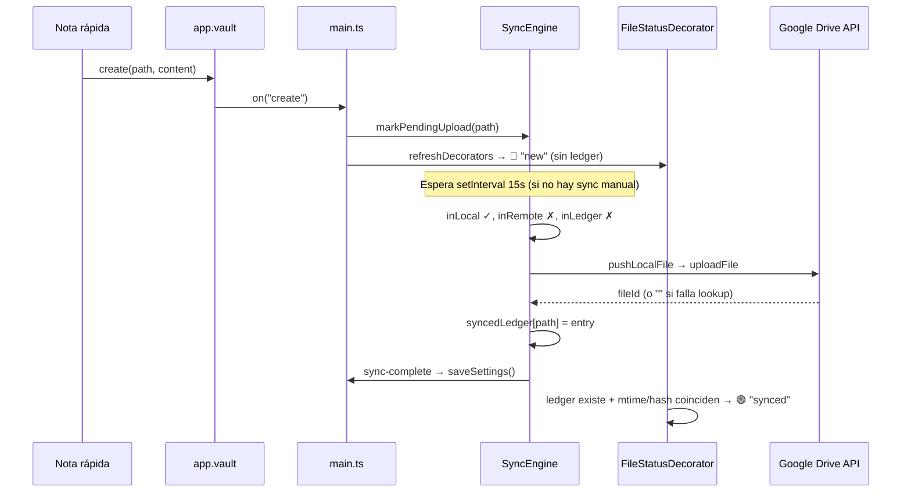
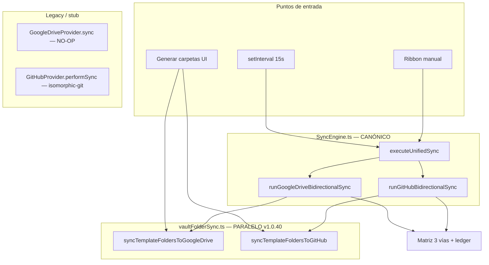

# Informe de Auditoría Integral — ObSave v1.0.40

**Ad Astra Forge** · Plugin ObSave  
**Fecha:** 8 de septiembre de 2026  
**Commit auditado:** `f3ab302` (release v1.0.40)  
**Alcance:** Regresiones en motor Google Drive, temporizador auto-sync, borrado remoto, atajos macOS/Electron y fragmentación de código  
**Nota:** Análisis sin release asociado.

---

## Resumen ejecutivo

| # | Área | Veredicto | Severidad | Causa raíz principal |
|---|------|-----------|-----------|----------------------|
| 1 | Motor / temporizador idle | **Regresión confirmada** | **Crítica** | No hay encolado de sync en `vault.on(create/modify)`; ticks automáticos se **descartan en silencio** si `syncInFlight`; v1.0.40 alarga cada ciclo con sync de carpetas |
| 2 | Notas verdes sin subir | **Regresión confirmada** | **Crítica** | Badge verde basado solo en `syncedLedger` local (no verifica remoto); ledger puede persistirse sin `driveFileId` válido; sync puede no ejecutarse |
| 3 | Borrado Drive → local | **Bug confirmado** | **Crítica** | `confirmDriveFileDeleted` solo acepta HTTP **404**; archivos en **papelera Drive** responden **200 + trashed:true** |
| 4 | Atajos macOS | **Colisión confirmada** | **Alta** | `Cmd+Opt+M` (minimizar) e `Cmd+Opt+I` (DevTools Electron) interceptados por SO/shell |
| 5 | Fragmentación código | **Deuda técnica** | **Media** | `vaultFolderSync.ts` duplica llamadas; `getOrCreateTargetFolder` invocado dos veces por ciclo; stub `GoogleDriveProvider.sync()` legacy |

---

## 1. Desconexión del motor en tiempo real (SyncEngine / Timer Idle)

### 1.1 Síntoma

Las notas rápidas y cambios en carpetas **no se sincronizan cada 15 s** en segundo plano. Parecen subirse solo al **cerrar y reabrir Obsidian** (recarga del plugin → sync inicial).

### 1.2 Hallazgos en código

#### A) Los eventos del vault NO encolan sincronización

En `main.ts`, los listeners solo refrescan decoradores o marcan pending upload:

```typescript
// vault.on("create") — líneas 76-83
this.syncEngine.markPendingUpload(file.path);
void this.refreshDecoratorsImmediate();

// vault.on("modify") — líneas 86-93
void this.refreshDecoratorsImmediate();
```

**Ninguno llama a `executeUnifiedSync()`.** La única fuente de sync automática es:

```typescript
// SyncEngine.startAutoSync() — líneas 147-149
this.autoSyncIntervalId = window.setInterval(() => {
  void this.executeUnifiedSync("automatic");
}, intervalMs);
```

**Conclusión:** ObSave depende **exclusivamente** del `setInterval`. No existe sync reactivo ante cambios locales.

#### B) Ticks automáticos descartados en silencio (`syncInFlight`)

```typescript
// SyncEngine.executeUnifiedSync() — líneas 166-177
if (this.syncInFlight) {
  if (trigger === "manual") {
    this.emit({ type: "sync-skipped", ... });
  }
  return { ran: false, skippedReason: "already-syncing" };
}
```

| Trigger | Sync en curso | Comportamiento |
|---------|---------------|----------------|
| `manual` | Sí | Emite `sync-skipped` + Notice |
| `automatic` | Sí | **Retorno silencioso**, sin log, sin reintento |

Si un ciclo dura **> 15 s**, los ticks intermedios se **pierden permanentemente** (no hay cola ni debounce trailing).

#### C) v1.0.40 alarga cada ciclo de sync

Al inicio de **cada** `runGoogleDriveBidirectionalSync`:

```typescript
const folder = await provider.getOrCreateTargetFolder();          // API #1
await syncTemplateFoldersToGoogleDrive(provider);                 // getOrCreateTargetFolder OTRA VEZ + 6× resolveOrCreateFolderPath
const remoteFiles = await provider.listAllMarkdownFiles(...);     // walk recursivo completo
```

`syncTemplateFoldersToGoogleDrive` vuelve a llamar `getOrCreateTargetFolder()` internamente → **duplicación de API** en cada ciclo.

Con bóvedas medianas/grandes, esto empuja la duración del ciclo por encima del intervalo de 15 s → **avalancha de ticks descartados**.

#### D) Preflight silencioso en sync automática

`validateSyncPreflight()` solo emite errores visibles cuando `trigger === "manual"`. Condiciones como `gdrive-no-folder`, `not-configured` abortan sync automática **sin Notice ni log estructurado**.

#### E) `UPLOAD_GRACE_MS` y `syncGeneration`

| Mecanismo | ¿Bloquea el timer? |
|-----------|-------------------|
| `UPLOAD_GRACE_MS` (60 s) | **No** bloquea ejecución del ciclo; solo altera rama upload/trash por archivo |
| `syncGeneration` / `cancelActiveSync` | Solo invalida resultado **al final** del ciclo; no impide arranque |
| `syncInFlight` | **Sí** — impide arranque de nuevo ciclo |

#### F) Por qué funciona al reiniciar Obsidian

1. `onload()` → `startAutoSync()` programa timer fresco.
2. `syncInFlight = null` (estado limpio).
3. Usuario suele interactuar (ribbon, settings) → sync manual posible.
4. Al recargar, el primer ciclo no compite con uno previo bloqueado.

### 1.3 Respuesta directa

> ¿Por qué no sincroniza a los 15 s?

Porque **(a)** no hay trigger reactivo en create/modify, **(b)** el intervalo es la única vía, **(c)** si el ciclo anterior sigue activo los ticks automáticos se ignoran sin reintento, y **(d)** v1.0.40 incrementó la duración del ciclo con sync de carpetas duplicado.

### 1.4 Plan de corrección (P0)

1. **Debounce trailing sync** en `vault.on("create"|"modify"|"delete"|"rename")` → `scheduleDebouncedSync(3000ms)`.
2. **Cola de sync pendiente**: si `syncInFlight`, marcar `pendingAutoSync = true` y ejecutar al finalizar el ciclo actual.
3. **Mover `syncTemplateFoldersToGoogleDrive`** fuera del hot path: solo en botón «Generar carpetas» o flag `structureDirty`.
4. Pasar `folderId` ya resuelto a `syncTemplateFoldersToGoogleDrive` para evitar doble `getOrCreateTargetFolder`.
5. Log estructurado en descartes automáticos: `console.debug('[ObSave] auto-sync skipped:', reason)`.

---

## 2. Pérdida de sincronización en notas individuales (Notas huérfanas / badge verde)

### 2.1 Síntoma

Nota creada con **Nota rápida** muestra badge **verde** (sincronizada) en el explorador pero **nunca aparece en Google Drive**.

### 2.2 Flujo auditado: creación → `pushLocalFile()`



### 2.3 Causas identificadas

#### A) Badge verde ≠ confirmación remota

`FileStatusDecorator.computeGoogleDriveStatuses()` (líneas 84-113):

- **Verde** si existe entrada en `syncedLedger` y metadata local coincide con ledger.
- **No consulta Google Drive** para verificar presencia real.

Por tanto, un ledger local **suficiente** produce verde aunque el archivo no exista en la nube.

#### B) Ledger persistido con `driveFileId` vacío

`pushLocalFile()` acepta ID vacío sin error:

```typescript
return created?.id ?? existingFileId ?? "";  // puede ser ""
buildLedgerEntry(..., driveFileId: driveFileId || undefined)
```

Si `uploadFile` tiene éxito pero el ID no se parsea, el ledger queda **sin `driveFileId`** pero con hash/mtime → **verde engañoso**.

#### C) Decorador fuerza verde durante sync

```typescript
if (isSyncing) {
  statuses.set(file.path, "synced");  // 🟢 para TODOS los archivos con ledger
}
```

Durante ciclos largos o atascados en `syncing`, el usuario ve verde **antes** de completarse la subida.

#### D) Sync puede no ejecutarse (ver sección 1)

Si el timer no corre ciclos efectivos, la nota debería permanecer **roja** (sin ledger). Si el usuario ve **verde**, el ledger **fue escrito** en algún ciclo previo — posiblemente con upload fallido parcial o entrada stale de path reutilizado.

#### E) Rama `inLocal && !inRemote && inLedger` + grace period

Durante 60 s post-creación, `shouldProtectLocalUpload` fuerza upload en la rama con ledger. Pero la rama **`!inLedger`** (nota nueva) sube **sin** grace check — correcto, siempre que el ciclo se ejecute.

#### F) No hay verificación post-upload

Tras `pushLocalFile`, no se valida que el archivo aparezca en `listAllMarkdownFiles` antes de escribir ledger.

### 2.4 Respuesta directa

> ¿Se queda atascada en syncedLedger como "ya sincronizada"?

**Sí, en la práctica:** el ledger actúa como fuente de verdad para el badge verde **sin corroboración remota**. Un entry con hash/mtime correctos pero sin archivo en Drive produce exactamente el síntoma reportado.

### 2.5 Plan de corrección (P0)

1. Badge **verde solo** si ledger tiene `driveFileId` **y** (opcional) verificación remota periódica.
2. Tras upload, **re-listar** remoto o usar ID de respuesta; si no hay ID → badge **amarillo** + reintento.
3. No marcar `synced` en decorador durante `isSyncing`; usar estado `pending`.
4. Persistir ledger **solo** tras confirmación de ID remoto.

---

## 3. Propagación de borrado desde Drive (Web → Local)

### 3.1 Síntoma

Al borrar una nota desde la **web de Google Drive**, la nota **permanece en Obsidian** durante ciclos subsiguientes. No se ejecuta `app.vault.trash()`.

### 3.2 Flujo esperado vs. real

**Escenario:** usuario mueve archivo a papelera en Drive web.

| Paso | Estado esperado | Estado real |
|------|-----------------|-------------|
| `listAllMarkdownFiles` | Archivo ausente (`trashed=false`) | ✅ Correcto — query excluye papelera |
| Matriz sync | `inLocal ✓, inRemote ✗, inLedger ✓` | ✅ Entra en `resolveLocalMissingOnRemoteGoogleDrive` |
| Verificación borrado | Detectar eliminación remota | ❌ **`confirmDriveFileDeleted` falla** |
| Acción | `vault.trash(local)` | ❌ Ejecuta **upload** en su lugar |

### 3.3 Bug crítico: `confirmDriveFileDeleted` incompleto

```typescript
// GoogleDriveProvider.ts — líneas 567-572
async confirmDriveFileDeleted(fileId: string): Promise<boolean> {
  const response = await this.driveRequest({
    url: `${GOOGLE_DRIVE_API}/files/${fileId}?fields=id`,
    method: "GET",
  });
  return response.status === 404;  // ← SOLO 404
}
```

**Comportamiento real de Google Drive API:**

| Estado del archivo en Drive | HTTP | `trashed` | `confirmDriveFileDeleted` |
|----------------------------|------|-----------|----------------------------|
| Activo | 200 | false | `false` (correcto) |
| En papelera (delete web) | **200** | **true** | **`false` ← BUG** |
| Eliminado permanentemente | 404 | — | `true` (correcto) |

Cuando el usuario "borra" desde la web, el archivo va a **papelera**, no desaparece con 404. La función devuelve `false` → el motor interpreta "no confirmado" → **`uploadLocalToGoogleDrive`** (intentando PATCH sobre archivo en papelera) → la nota local **permanece intacta**.

### 3.4 Rama `inLocal && inRemote` no aplica

Si el archivo ya no está en el listado remoto, no entra en `syncBothPresent`. El problema está **exclusivamente** en la verificación de borrado de la rama `!inRemote && inLedger`.

### 3.5 Caso adicional: `syncBothPresent` early exit

Si por caché/latencia el archivo aún apareciera en listado remoto tras borrado, `syncBothPresent` podría retornar `action: "none"` cuando metadata local/remota/ledger coinciden — otro camino que preservaría la nota local.

### 3.6 Plan de corrección (P0)

```typescript
async confirmDriveFileDeleted(fileId: string): Promise<boolean> {
  const response = await this.driveRequest({
    url: `${GOOGLE_DRIVE_API}/files/${fileId}?fields=id,trashed`,
    method: "GET",
  });
  if (response.status === 404) return true;
  if (response.status === 200) {
    const data = response.json as { trashed?: boolean };
    return data.trashed === true;
  }
  return false;  // error de red → no borrar local (fail-safe)
}
```

Adicionalmente:

1. Nueva rama explícita en matriz: `inLocal ✓, inRemote ✗, inLedger ✓, driveFileId ✓, trashed remoto` → trash local.
2. Tests manuales: borrado web → papelera → local eliminado en ≤15 s.

---

## 4. Colisión crítica de atajos (macOS / Electron)

### 4.1 Asignación actual (v1.0.40)

| Comando | Atajo registrado | Badge UI (Mac) |
|---------|------------------|----------------|
| Panel ObSave | `Mod+Alt+O` | Cmd+Option+O |
| Nota rápida | `Mod+Alt+N` | Cmd+Option+N |
| Captura | `Mod+Alt+M` | Cmd+Option+M |
| Informe | `Mod+Alt+I` | Cmd+Option+I |

Registro en `main.ts` líneas 291-318.

### 4.2 Colisiones confirmadas

| Atajo | Conflicto | Capturado por |
|-------|-----------|---------------|
| **Cmd+Opt+M** | Minimizar ventana | **macOS / Electron shell** |
| **Cmd+Opt+I** | Inspector / DevTools | **Electron** (Chromium) |
| Cmd+Opt+N | Posible conflicto con ventanas nuevas | Variable según plugins |
| Cmd+Opt+O | Menor riesgo | — |

Obsidian registra hotkeys como **defaults sugeridos**; si el SO intercepta la combinación, **el comando nunca se ejecuta** aunque aparezca en Ajustes → Atajos.

`formatShortcutLabel()` (v1.0.40) muestra correctamente `Cmd+Option+*` pero **no resuelve** la interceptación del SO.

### 4.3 Plan de corrección (P1)

**Opción A — Sin defaults (recomendada por Obsidian community):**

```typescript
this.addCommand({
  id: "obsave-quick-note",
  name: "Crear nota rápida ObSave",
  // Sin hotkeys — usuario asigna en Ajustes → Atajos
  callback: () => void createQuickDailyNote(this.app),
});
```

**Opción B — Combinaciones Hyper de bajo conflicto:**

| Comando | Atajo propuesto | Conflicto macOS |
|---------|-----------------|-----------------|
| Panel | `Mod+Ctrl+O` | Bajo |
| Nota rápida | `Mod+Ctrl+N` | Bajo |
| Captura | `Mod+Ctrl+M` | Bajo |
| Informe | `Mod+Ctrl+J` | Bajo (evita I) |

**Opción C — Mod+Shift con letras poco usadas:**

`Mod+Shift+9`, `Mod+Shift+0`, etc. (menos mnemónicos).

Implementar **A + documentación en VISTA 1** con enlace a Ajustes → Atajos filtrando `obsave:`.

---

## 5. Fragmentación y duplicación de código de sincronización

### 5.1 Mapa de pipelines actuales



### 5.2 Duplicaciones detectadas

| Duplicación | Ubicación | Impacto |
|-------------|-----------|---------|
| `getOrCreateTargetFolder()` ×2 | `runGoogleDriveBidirectionalSync` L330 + `vaultFolderSync` L36 | +1 round-trip API/ciclo |
| `resolveOrCreateFolderPath` ×6/ciclo | Cada sync automático | Latencia innecesaria |
| `GoogleDriveProvider.sync()` stub | Retorna éxito sin operar | Confusión; no usado por SyncEngine pero existe en `IStorageProvider` |
| `GitHubProvider.performSync()` (git) | Coexiste con REST en SyncEngine | Dos implementaciones GitHub; solo REST activa |
| Lógica upload/trash | `resolveLocalMissing*` + rama `!inLedger` + `syncBothPresent` | Repetición de `pushLocalFile` / ledger write |

### 5.3 Evaluación arquitectónica

**No hay un segundo motor de sync activo para GDrive** — `SyncEngine` es el pipeline real. La regresión v1.0.40 proviene de **hooks periféricos** (`vaultFolderSync`) insertados en el hot path sin integrarse al modelo de eventos/debounce.

### 5.4 Propuesta de simplificación (P1–P2)

1. **Un solo método de preflight estructural:**

```typescript
// SyncEngine.ts
private async ensureRemoteFolderStructure(provider, rootFolderId): Promise<void> {
  if (!this.settings.structureSyncNeeded) return;
  await ensureTemplateFolders(provider, rootFolderId);
  this.settings.structureSyncNeeded = false;
}
```

2. **Eliminar llamada automática** a `vaultFolderSync` en cada ciclo; activar solo con botón UI o flag tras generar carpetas.

3. **Deprecar** `GoogleDriveProvider.sync()` stub → lanzar error dirigindo a SyncEngine.

4. **Consolidar** upload en un helper único:

```typescript
private async uploadAndLedger(path, file, provider, ledger): Promise<boolean> {
  const remoteId = await this.pushLocalFile(...);
  if (!remoteId) return false;
  ledger[path] = this.buildLedgerEntry(..., remoteId);
  return true;
}
```

5. **Mover** `vaultFolderSync.ts` como métodos privados de SyncEngine o submódulo `SyncStructureAdapter` invocado explícitamente.

---

## 6. Matriz de regresiones v1.0.38 → v1.0.40

| Cambio v1.0.39/40 | Efecto observado |
|-------------------|------------------|
| `UPLOAD_GRACE_MS` + `markPendingUpload` | Retrasa trash legítimo; no bloquea timer pero altera ramas |
| `confirmDriveFileDeleted` solo 404 | **Rompe propagación borrado web → local** |
| `syncTemplateFoldersToGoogleDrive` en cada sync | **Alarga ciclo → ticks descartados** |
| Atajos `Mod+Alt+*` | **Colisión macOS/Electron** |
| Badge sin validación remota | **Verde engañoso** |

---

## 7. Plan de corrección consolidado (sin release)

| Prioridad | ID | Acción | Archivos |
|-----------|-----|--------|----------|
| **P0** | FIX-01 | Debounce sync en vault events + cola post `syncInFlight` | `main.ts`, `SyncEngine.ts` |
| **P0** | FIX-02 | `confirmDriveFileDeleted`: 404 **o** `trashed:true` | `GoogleDriveProvider.ts` |
| **P0** | FIX-03 | Badge verde requiere `driveFileId`; estado `pending` durante sync | `FileStatusDecorator.ts` |
| **P0** | FIX-04 | Validar ID post-upload antes de escribir ledger | `SyncEngine.ts` |
| **P1** | FIX-05 | Sacar folder sync del hot path (flag/botón) | `SyncEngine.ts`, `vaultFolderSync.ts` |
| **P1** | FIX-06 | Eliminar defaults hotkeys; doc en UI | `main.ts`, `ObSaveSettingTab.ts` |
| **P2** | FIX-07 | Consolidar upload/ledger helpers | `SyncEngine.ts` |
| **P2** | FIX-08 | Deprecar stubs sync legacy | `GoogleDriveProvider.ts`, `GitHubProvider.ts` |

---

## 8. Verificación manual post-fix

1. Crear nota rápida → verificar upload en Drive en **≤20 s** sin reiniciar Obsidian.
2. Badge rojo/amarillo hasta confirmación remota; verde solo con `driveFileId`.
3. Borrar nota en Drive web → desaparece local en **≤20 s**.
4. Atajos: asignar manualmente sin conflicto; verificar en Paleta de comandos.
5. Generar carpetas → estructura en Drive sin alargar cada ciclo automático.
6. Consola: ningún `auto-sync skipped: already-syncing` repetido en 60 s de uso normal.

---

## 9. Archivos auditados

| Archivo | Rol en regresión |
|---------|------------------|
| `src/engine/SyncEngine.ts` | Timer, matriz 3 vías, grace, folder sync hot path |
| `src/main.ts` | Eventos vault, comandos, auto-sync lifecycle |
| `src/ui/FileStatusDecorator.ts` | Badge verde engañoso |
| `src/productivity/vaultFolderSync.ts` | Duplicación API carpetas |
| `src/providers/GoogleDriveProvider.ts` | `confirmDriveFileDeleted`, upload, list |
| `src/providers/GoogleDriveLazyProvider.ts` | Proxy delegate |
| `src/utils/shortcutLabel.ts` | Etiquetas UI (no funcional hotkey) |
| `src/productivity/noteCapture.ts` | Creación nota rápida |

---

## 10. Respuestas directas al auditor

| # | Pregunta | Respuesta |
|---|----------|-----------|
| 1 | ¿Por qué no sync a 15 s? | Sin trigger reactivo; ticks automáticos descartados si `syncInFlight`; ciclos más largos por folder sync v1.0.40 |
| 1b | ¿`vault.on` notifica al motor? | **No encola sync** — solo `markPendingUpload` y decoradores |
| 2 | ¿Verde pero no en Drive? | Ledger local = fuente del badge; puede existir sin `driveFileId` válido; sync puede no completar upload |
| 3 | ¿Por qué no trash local tras borrar en web? | **`confirmDriveFileDeleted` no detecta papelera** (200+trashed, no 404) → re-upload en lugar de trash |
| 4 | ¿Atajos rotos? | **Cmd+Opt+M/I interceptados por macOS/Electron** |
| 5 | ¿Código fragmentado? | **Sí** — `vaultFolderSync` en hot path + stubs legacy; propuesta: pipeline único con structure sync bajo demanda |

---

*Documento generado a partir de auditoría estática del código ObSave v1.0.40 — Ad Astra Forge.*
